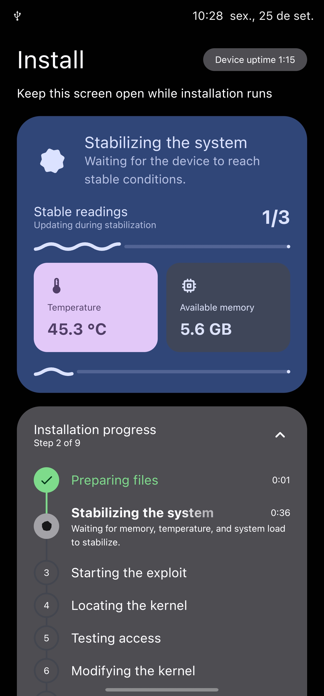
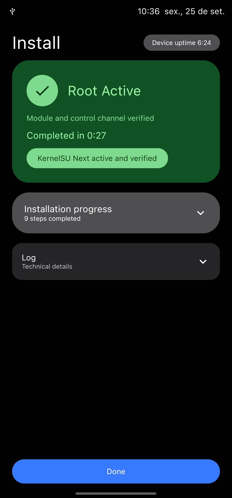
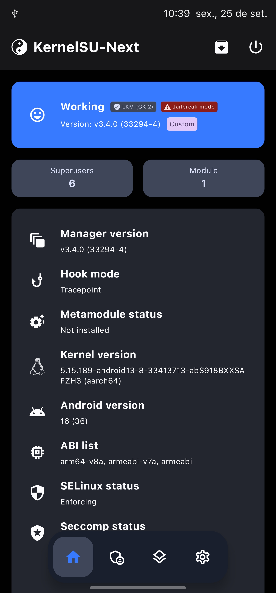

# Root My Galaxy · SM-S918B

**Version 0.6.0** · Samsung Galaxy S23 Ultra (`SM-S918B`, `dm3q`)

Root My Galaxy provides an Android app and a command-line runner for loading
KernelSU on specific SM-S918B firmware builds. The app selects a bundled payload
using the device's exact build and kernel identity. The AFZH3 path uses the open
payload engine, a stability launcher, and KernelSU Next **v3.4.0**.

[Releases](https://github.com/soumarcelino/Root-My-Galaxy-SM-S918B/releases) ·
[Documentation](docs/README.md)

Use this project only on devices you own or are authorized to test. A matching
model alone is insufficient: payloads and kernel modules are tied to a specific
firmware build.

## App screenshots

AFZH3 installation flow: stabilization checks, the app's root verification
screen, and the KernelSU Next v3.4.0 manager.

<table>
  <tr>
    <th>Stability readings</th>
    <th>Root active</th>
    <th>KernelSU Next v3.4.0</th>
  </tr>
  <tr>
    <td></td>
    <td></td>
    <td></td>
  </tr>
</table>

## Firmware profiles

| Firmware | Root integration | Project files |
| --- | --- | --- |
| `S918BXXSAFZF5` | KernelSU | [`targets/afzf5/`](targets/afzf5/) |
| `S918BXXSAFZG1` | KernelSU Next v3.3.0 | [`targets/afzg1/`](targets/afzg1/) |
| `S918BXXSAFZH3` | KernelSU Next v3.4.0 | [`targets/afzh3/`](targets/afzh3/) |

The app's [target manifest](app/src/main/assets/targets-v3.json) contains the
exact build, fingerprint, kernel release, and artifacts for each profile. The
`zzhl-WIP` directory is work in progress; it is not part of the AFZH3 flow.

## AFZH3 target

The current AFZH3 integration targets Android 16 and this exact device build:

```text
model: SM-S918B
device: dm3q
build display: BP4A.251205.006.S918BXXSAFZH3
kernel release: 5.15.189-android13-8-33413713-abS918BXXSAFZH3
kernel build: #1 SMP PREEMPT Tue Aug 11 06:33:52 UTC 2026
```

The AFZH3 KernelSU Next v3.4.0 module is built for Samsung's AFZH3 kernel.
The generic v3.4.0 module is incompatible with this target; see the
[AFZH3 KernelSU guide](targets/afzh3/kernelsu-next/README.md) for build and
compatibility details.

## Build and use

To build the Android debug APK, install the Android SDK and JDK, then run:

```sh
cd app
./gradlew assembleDebug
```

The APK is written to `app/build/outputs/apk/debug/app-debug.apk`. After
installing it, check that the detected firmware matches a bundled profile
before starting the root flow. Shizuku is optional and is used only when its
mode is enabled in the app.

For the AFZH3 command-line flow, use the
[simple-root runner](simple-root/README.md). It builds and stages the AFZH3
payload and launcher, then checks temporary root and KernelSU. Start from a
clean boot and follow the runner's device checks before attempting a run.

## Repository layout

```text
app/                    Android app and bundled target profiles
RootMyGalaxyDesktop/    Desktop GUI and helper source
simple-root/            AFZH3 command-line runner
stability-launcher/     AFZH3 launcher and stability gates
targets/afzf5/          AFZF5 payload, helper, and KernelSU files
targets/afzg1/          AFZG1 payload, helper, and KernelSU Next files
targets/afzh3/          AFZH3 open payload, helper, and KernelSU Next files
targets/zzhl-WIP/       Work in progress for another firmware build
tools/                  Porting and development utilities
docs/                   Project guides and screenshots
```

For implementation details, see the [AFZH3 open payload engine](targets/afzh3/open-payload-engine/README.md),
the [KernelSU Next v3.4.0 guide](targets/afzh3/kernelsu-next/README.md), and
the [documentation index](docs/README.md). The older porting guides under
`docs/` describe the AFZF5/AFZG1 workflows and should not be used to prepare
AFZH3 app assets.

## Credits

This SM-S918B adaptation builds on
[youyoudezhuzhu/rmg-f731u](https://github.com/youyoudezhuzhu/rmg-f731u).

## 🇧🇷 É Brazuca também?

Deixe um apoio usando Pix 💙

Sua ajuda motiva expandir esse trabalho pra novos devices, e é um jeito de
agradecer pelas noites sem dormir por trás desse port :)

<p align="center">
  
</p>
