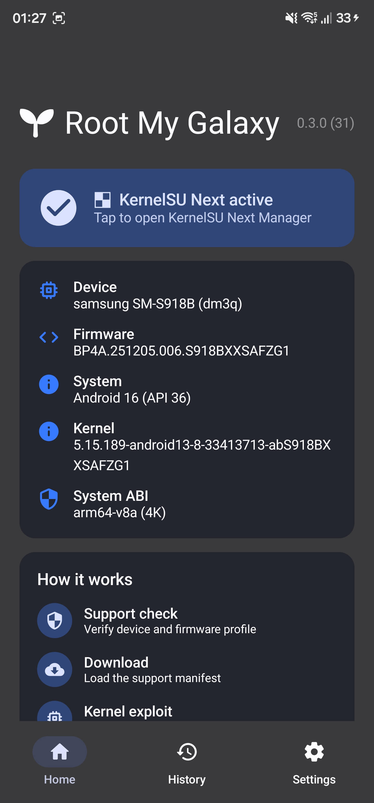
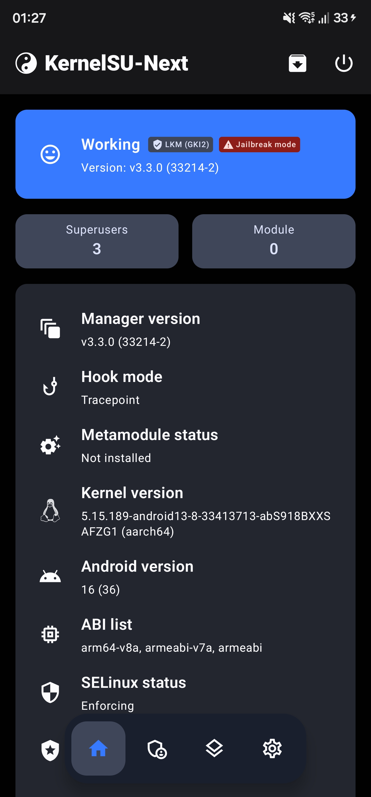

# Root My Galaxy SM-S918B

Root My Galaxy v0.4.0 brings KernelSU Next support and exact firmware-profile
selection to the Samsung Galaxy S23 Ultra `SM-S918B` (`dm3q`). This repository
contains the Android app, target configuration, porting sources, patches, and
build tools for the project.

[Releases](https://github.com/soumarcelino/Root-My-Galaxy-SM-S918B/releases) ·
[Documentation](docs/README.md)

Use this only on devices you own or are explicitly authorized to test.

# Root My Galaxy v0.4.0 is here

## Firmware support added in v0.4.0

- New support for firmware `S918BXXSAFZH3`.
- Security patch level: `05/08/2026`.
- The previous `S918BXXSAFZG1` payload remains bundled for older compatible
  devices.

## Now with KernelSU Next support

<table>
  <tr>
    <td align="center"><strong>Root My Galaxy app</strong></td>
    <td align="center"><strong>KernelSU Next</strong></td>
  </tr>
  <tr>
    <td align="center">
      
    </td>
    <td align="center">
      
    </td>
  </tr>
</table>

## Validated Target

```text
model: SM-S918B
device: dm3q
build display: BP4A.251205.006.S918BXXSAFZH3
fingerprint: samsung/dm3qxxx/dm3q:16/BP4A.251205.006/S918BXXSAFZH3:user/release-keys
kernel release: 5.15.189-android13-8-33413713-abS918BXXSAFZH3
kernel build: #1 SMP PREEMPT Tue Aug 11 06:33:52 UTC 2026
```

## Prerequisites

Before running the port, make sure the phone is ready:

1. **Enable Developer options and USB debugging**.
2. **Install [Shizuku](https://shizuku.rikka.app/).** It performs the
   privileged operations this app needs, without a full root shell.
3. **Reboot the phone.** A clean boot avoids stale permission/service state
   and makes the whole flow work on the first try.
4. **Close every other app and background process.** Keep only Shizuku and
   Root My Galaxy running.
5. **Start the Shizuku service**
6. **Open Root My Galaxy** and grant it permission when Shizuku prompts.

The script prints the manual ADB test commands at the end. It does not open a
root shell automatically.

## Documentation

- [Documentation Index](docs/README.md): all detailed project docs.
- [Target Profile](docs/TARGET.md): exact device and firmware values expected by this port.
- [Project Structure](docs/PROJECT_STRUCTURE.md): what each directory contains.
- [Reproduce The Port](docs/REPRODUCE_PORT.md): full payload generation flow.
- [Build, Install, And ADB](docs/BUILD_INSTALL_ADB.md): app build, install, staging, and manual test commands.
- [Troubleshooting](docs/TROUBLESHOOTING.md): common failures and how to diagnose them.

Upstream reference material is also kept in:

- [PORTING.md](PORTING.md)
- [PROJECT-MANIFEST.txt](PROJECT-MANIFEST.txt)
- [targets/afzf5/kernelsu/README.md](targets/afzf5/kernelsu/README.md)
- [KernelSU Next AFZG1](targets/afzg1/kernelsu-next/README.md)


## Quick Start

The Android app uses KernelSU Next v3.3.0 with a profile selected from the
detected firmware. Both `S918BXXSAFZG1` and `S918BXXSAFZH3` have version-locked
payloads and helpers; see [KernelSU Next AFZG1](targets/afzg1/kernelsu-next/README.md).

From the repository root:

```sh
./tools/port-sm-s918b-afzf5.sh
```

Build the debug APK:

```sh
./tools/port-sm-s918b-afzf5.sh --build-apk
```

Build, install, and stage local ADB files:

```sh
./tools/port-sm-s918b-afzf5.sh --all
```


## Repository Structure

```text
app/                    Android app, Gradle build, and bundled target profiles
RootMyGalaxyDesktop/    Desktop GUI and helper source
simple-root/            ADB runner for the AFZH3 open payload
stability-launcher/     Launcher used by the AFZH3 root flow
targets/
  afzf5/                AFZF5 native payload, helper, KernelSU, and specs
  afzg1/                AFZG1 payload, helper, and KernelSU Next
  afzh3/                AFZH3 open payload engine, helper, and KernelSU Next
  zzhl-WIP/             ZZHL firmware references and work-in-progress payload
tools/                  Porting and payload patch tools
docs/                   Project guides and screenshots
Makefile                Native payload build entry point
```

## Credits And Base Repository

This SM-S918B port is based on
[youyoudezhuzhu/rmg-f731u](https://github.com/youyoudezhuzhu/rmg-f731u), the
Root-My-Galaxy F731U Z Flip5 payloads + APK repository.

Credit goes to that project for the F731U app/payload baseline, closed helper
flow, KernelSU late-load packaging, support manifest structure, and the porting
procedure used as the starting point for this SM-S918B adaptation.

This repository is an adaptation for `SM-S918B` / `dm3q` with profiles for
`S918BXXSAFZG1` and `S918BXXSAFZH3`, not the original F731U target.

## 🇧🇷 É Brazuca também? 

Deixe um apoio usando Pix 💙

Sua ajuda motiva expandir esse trabalho pra novos devices, e é um jeito de
agradecer pelas noites sem dormir por trás desse port :)

<p align="center">
  
</p>
