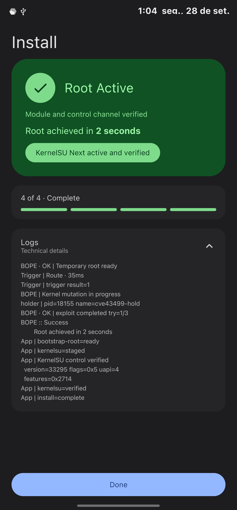
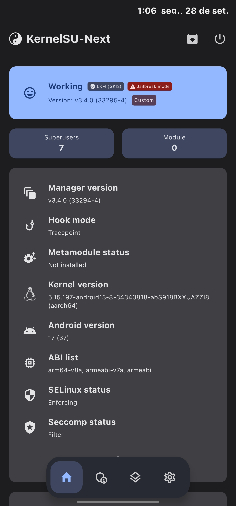

# Root My Galaxy · SM-S918B

**Version 0.6.0-beta-3** · Samsung Galaxy S23 Ultra (`SM-S918B` / `SM-S918N`, `dm3q`)

[Latest pre-release: v0.6.0-beta-3](https://github.com/soumarcelino/Root-My-Galaxy-SM-S918B/releases/tag/v0.6.0-beta-3)

**One click Root.**

Root My Galaxy is our attempt to make rooting a supported Galaxy S23 Ultra feel
almost boring: open the app, tap once, and let it cook. The modern flow runs on
**BOPE :: the Brazilian Open Payload Engine**, a fully open rewrite built from
scratch to be quick, readable, and seriously stable. Most successful runs get
root in **under 5 seconds**.

And the newest port, made for `S918BXXUAZZI8`, the **latest One UI 9 Beta 2
firmware**, is something special. It came from deep analysis, stubborn
debugging, hundreds of reboots and executions, and optimization after
optimization. Every failed run left a clue, and every reboot pushed BOPE
forward, until a difficult port became a state-of-the-art engine. The result:
after stabilization, BOPE reaches root in an honestly **impressive 2 seconds**,
a tiny number carrying a huge amount of work.

Modern targets use BOPE exclusively. The old FZF5 profile remains available as
a clearly marked legacy compatibility target.

[Releases](https://github.com/soumarcelino/Root-My-Galaxy-SM-S918B/releases) ·
[Documentation](docs/README.md)

Each target is tied to an exact model, firmware, kernel, and fingerprint. Think
of it as a key cut for one very specific lock: matching only the phone model is
not enough.

## App screenshots

Latest One UI 9 Beta 2 firmware validation: Root My Galaxy completing the
payload in **2 seconds** and KernelSU Next v3.4.0 running on the exact
`S918BXXUAZZI8` kernel.

<table>
  <tr>
    <th>Root My Galaxy</th>
    <th>KernelSU Next v3.4.0</th>
  </tr>
  <tr>
    <td></td>
    <td></td>
  </tr>
</table>

## Targets

These are all payload profiles currently shipped in the app:

| Device | Firmware | System | Payload | Root integration | Target files |
| --- | --- | --- | --- | --- | --- |
| `SM-S918B` | `S918BXXUAZZI8` · **latest One UI 9 Beta 2 firmware** | One UI 9 / Android 17 | **BOPE :: Brazilian Open Payload Engine (State of Art Engine)** | KernelSU Next v3.4.0 | [`targets/zzi8-WIP/`](targets/zzi8-WIP/) |
| `SM-S918B` | `S918BXXUAZZHL` | One UI 9 / Android 17 | **BOPE :: Brazilian Open Payload Engine (State of Art Engine)** | KernelSU Next v3.4.0 | [`targets/zzhl/`](targets/zzhl/) |
| `SM-S918B` | `S918BXXSAFZH3` | One UI 8.5 / Android 16 | **BOPE-Beta :: Brazilian Open Payload Engine** | KernelSU Next v3.4.0 | [`targets/afzh3/`](targets/afzh3/) |
| `SM-S918B` | `S918BXXSAFZG1` | One UI 8.5 / Android 16 | **BOPE-Beta :: Brazilian Open Payload Engine** | KernelSU Next v3.3.0 | [`targets/afzg1/`](targets/afzg1/) |
| `SM-S918N` | `S918NKSS8FZG1` | One UI 8.5 / Android 16 | **BOPE-Beta :: Brazilian Open Payload Engine** | KernelSU Next | App-bundled profile |
| `SM-S918B` | `S918BXXSAFZF5` | One UI 8.5 / Android 16 | **Old Chinese Payload** | KernelSU | [`targets/afzf5/`](targets/afzf5/) |

The app's [target manifest](app/src/main/assets/targets-v3.json) is the source of
truth for the exact build display, fingerprint, kernel release, and binaries.
If those values do not match, the app stops instead of gambling with the wrong
payload.

## So, what is BOPE?

BOPE is the part that gets its hands dirty. It replaces the old closed chinese payload
path with an engine anyone can read, audit, port, and improve. Each firmware
keeps its own addresses and constants in its target file, while the shared
exploit code stays reusable and much easier to reason about.

The One UI 9 ports also gained stricter preflight checks, deterministic retries,
a linear SELinux alias path, and much clearer staging errors. Add the stability
launcher and the result is a payload that knows when to go, when to wait, and
when to stop before touching the wrong firmware.

Want to see what happens under the hood? Open the
[complete BOPE ZZI8 execution flowchart for the latest One UI 9 Beta 2 firmware](targets/zzi8-WIP/brazilian-open-payload-engine/docs/FULL-EXECUTION-FLOW.md)
to follow the engine visually, from its first preflight check to KernelSU Next
and final root verification.

## Stability Launcher

A fresh Android boot may look calm, but under the hood it is chaos: apps wake
up, services fight for CPU, memory and I/O, the phone heats up, and kernel slabs
keep moving. BOPE is sensitive to timing, so launching in the middle of that
party can make a reliable exploit feel like a coin toss.

The Stability Launcher is BOPE's traffic light. It waits for Android and the
minimum uptime, then watches memory, temperature, runnable tasks, system
pressure, `mm_struct` slab activity, and pipe capacity. It only turns green
after consecutive clean samples; if the phone gets noisy, the count starts
again. A cool and clearly idle device gets the fast lane.

Once the runway is clear, the launcher steps aside and BOPE takes off. That wait
is measured separately, which is why the latest One UI 9 Beta 2 firmware,
ZZI8, reaches its impressive **2 seconds** in the payload itself, after the
launcher handled the chaos.

[Explore the complete visual BOPE ZZI8 execution flow for the latest One UI 9 Beta 2 firmware](targets/zzi8-WIP/brazilian-open-payload-engine/docs/FULL-EXECUTION-FLOW.md),
from the Stability Launcher and KASLR discovery to the futex trigger, pipe R/W,
temporary root, KernelSU Next, and every retry boundary.

## Run Simple Root

`simple-root` is the hands-on command-line route for the exact
**S918BXXUAZZI8** target, the latest One UI 9 Beta 2 firmware. It builds BOPE,
the ZZI8 Stability Launcher, the open helper, and KernelSU Next v3.4.0. It
rejects every other firmware before it builds or stages anything. Connect one
authorized device through ADB, start from a clean boot of the latest One UI 9
Beta 2 firmware (`ZZI8`), and run:

```sh
cd simple-root
./simple-root.sh
```

If more than one device is connected, pass the serial explicitly:

```sh
./simple-root.sh RXCX602E20X
```

The runner checks the complete latest One UI 9 Beta 2 firmware (`ZZI8`) device
identity and ELF/BTF contract, builds everything it needs, stages the files in
`/data/local/tmp`, waits for the
stability gate, launches BOPE, loads KernelSU, restores SELinux enforcing, and
finishes by checking `su -c id`. The full walkthrough lives in the
[Simple Root guide](simple-root/README.md).

## Build the payloads

Build commands for BOPE, BOPE-Beta, the legacy payload, and KernelSU Next live
in the [payload build guide](docs/BUILD-PAYLOADS.md).

## Port BOPE from an OTA

Have a Samsung incremental OTA and its source target? Let the porting pipeline
do the mechanical work:

```sh
./tools/bope-from-ota "/home/matias/Downloads/S23 Ultra ZZHL-ZZI8.zip"
```

It reconstructs and verifies boot, recovers ELF/kallsyms/BTF, generates the
firmware contract, builds BOPE and its helpers, audits KernelSU Next, and emits
the new target as `targets/<firmware>-WIP/`. It refuses to overwrite an existing
target, and device validation is still the final gate. The exact stages and
advanced options live in the [BOPE OTA porting guide](tools/bope/README.md).

## Repository layout

```text
app/                    Android app and bundled target profiles
RootMyGalaxyDesktop/    Latest One UI 9 Beta 2 firmware (ZZI8) desktop GUI
simple-root/            Latest One UI 9 Beta 2 firmware (ZZI8) runner
stability-launcher/     AFZH3 launcher and stability gates
targets/                Firmware targets, payloads, helpers, and KernelSU files
tools/                  Porting and development utilities
docs/                   Project guides and screenshots
```

For implementation details, visit the
[ZZI8 BOPE source for the latest One UI 9 Beta 2 firmware](targets/zzi8-WIP/brazilian-open-payload-engine/README.md), the
[ZZHL BOPE source](targets/zzhl/brazilian-open-payload-engine/README.md), the
[AFZH3 BOPE source](targets/afzh3/brazilian-open-payload-engine/README.md), or
the [documentation index](docs/README.md).

## Credits

The app started from [BuSung-dev/Root-My-Galaxy](https://github.com/BuSung-dev/Root-My-Galaxy),
which provided the base Android application.

The first closed payloads came from
[youyoudezhuzhu/rmg-f731u](https://github.com/youyoudezhuzhu/rmg-f731u) and made
the original SM-S918B adaptation possible.

**ChatGPT Daybreak Blue** helped decompile and understand the secret Chinese
code, then supported BOPE's ground-up rewrite all the way to its current
state-of-the-art form.

**Claude** contributed general improvements and additional support
throughout the work led with Daybreak Blue.

## 🇧🇷 É Brazuca também?

Deixe um apoio usando Pix.

Sua ajuda motiva expandir esse trabalho pra novos devices e é um jeito de
agradecer pelas noites sem dormir por trás desse port.

<p align="center">
  
</p>
