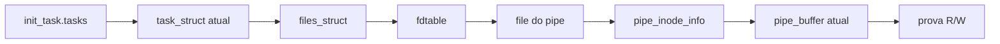

# Resolução direta do `pipe_buffer`

## Objetivo

Esta melhoria substitui, no caminho normal, a preparação probabilística do
segundo reclaim por uma resolução direta dos pipes que o próprio payload acabou
de criar. A primitiva ashmem/configfs já está ativa nesse ponto; ela é usada
para seguir ponteiros do processo atual até o `pipe_buffer` vivo. O reclaim
legado continua disponível como fallback quando a resolução direta falha e
todo estado temporário foi restaurado com segurança.

O código está em [`src/09_pipe_buffer_rw.c`](../src/09_pipe_buffer_rw.c).

## Resultado medido

O estágio anteriormente medido em 4905 ms passou a executar em 11–12 ms no
fluxo real do aplicativo:

| Execução | Tentativa | Tarefas percorridas | Pipe direto |
| --- | ---: | ---: | ---: |
| App 1 | 1/12 | 1 | 11 ms |
| App 2 | 1/12 | 1 | 11 ms |
| App 3 | 1/12 | 1 | 12 ms |

Média: 11,333 ms. A redução é de 99,769%, equivalente a 432,8 vezes menos
tempo nesse estágio. As diferenças no tempo total do app vieram do gate de
estabilidade do launcher, que aguardou aproximadamente 12, 38 e 50 segundos.

As evidências completas estão em
[`evidence/reliability/20260926-direct-app-3runs/`](../evidence/reliability/20260926-direct-app-3runs/analysis.md).

## Caminho anterior

Depois de confirmar AAR/AAW, o backend precisava descobrir uma página order-3
contendo objetos de pipe:

1. criar bancos drain e reclaim;
2. prender grandes quantidades de `mm_struct` por memfds;
3. executar o oráculo KernelSnitch;
4. liberar e reclamar a página order-3;
5. redimensionar os pipes;
6. identificar páginas kmalloc-2k;
7. varrer slabs procurando candidatos estruturais;
8. confirmar o candidato com uma alteração observável em `len`;
9. provar leitura e escrita.

Esse caminho depende do estado do allocator, do sinal do side channel e do
reclaim cair na página esperada. Mesmo quando passa na primeira tentativa, seu
custo inclui milhares de objetos, processos auxiliares e cleanup. Misses podem
repetir todo o preparo.

## Observação que permitiu eliminar o reclaim

Os 240 reclaim pipes já existem no processo que executa o payload. Depois que
AAR/AAW está ativa, todos os endereços necessários podem ser alcançados por
estruturas normais do kernel:



Assim, não é necessário prever em qual slab o pipe caiu. O endereço do objeto
é obtido diretamente da tabela de descritores do processo.

## Algoritmo atual

### 1. Criar e marcar os pipes

O caminho direto cria o banco `g_reclaim_pipes`, redimensiona cada pipe para 32
slots e escreve markers com comprimento `índice+1`. O comprimento continua
fornecendo uma associação inequívoca entre o objeto do kernel e o FD userspace.

### 2. Encontrar a tarefa atual pela cauda

O payload conhece seu PID por `getpid()`. A lista global começa em:

```text
kernel_base + OSS_INIT_TASK_OFF + OSS_TASK_TASKS_OFF
```

A busca parte de `init_task.tasks.prev`. Processos recém-criados são inseridos
próximos da cauda; como o launcher acabou de executar o payload, a tarefa atual
normalmente é o primeiro nó.

A primeira versão percorria a lista para frente. Ela leu 88 tarefas antes de
atingir uma tarefa transitória que saiu durante a varredura. A troca temporária
de cache não permaneceu instalada e foi restaurada, mas a resolução terminou
como miss. A busca reversa reduziu a janela de corrida: na PoC ela precisou de
três e uma leituras; nas três execuções do app, uma leitura em todas.

### 3. Resolver a tabela de FDs

Depois de localizar `task_struct`, o código lê:

```text
task_struct.files
files_struct.fdt
fdtable.fd
```

Os FDs de leitura de todos os reclaim pipes são convertidos em ponteiros
`struct file *` e guardados em um vetor local.

### 4. Resolver o `pipe_buffer`

Para cada `struct file` correspondente a um reclaim pipe:

```text
file.private_data -> pipe_inode_info
pipe_inode_info.bufs
pipe_inode_info.tail
pipe_inode_info.ring_size
```

O candidato é calculado por:

```text
bufs + (tail & (ring_size - 1)) * sizeof(struct pipe_buffer)
```

Ele só é aceito quando:

- todos os ponteiros pertencem ao direct-map esperado;
- `ring_size` é potência de dois;
- `ops == kernel_base + OSS_ANON_PIPE_BUF_OPS_OFF`;
- a estrutura satisfaz as invariantes do pipe;
- `len == índice_do_pipe + 1`.

### 5. Provar a primitiva

O endereço encontrado entra nas mesmas provas bidirecionais já usadas pelo
backend legado. O backend só é publicado como instalado depois que pipe e
configfs concordam nas leituras e escritas do scratch em `payload_base+0x7100`.

## Bloqueio por Hardened Usercopy

A resolução direta inicial tentou ler `task_struct.pid` com a AAR
ashmem/configfs. O kernel encerrou o boot com:

```text
usercopy: Kernel memory exposure attempt detected from SLUB object
'task_struct' (offset 1496, size 4)!
```

A pilha passou por `__check_heap_object`, `__check_object_size` e
`configfs_read_iter`, terminando em `usercopy_abort+0x90`. O registro completo
está em
[`direct-usercopy-crash-last-kmsg.txt`](../evidence/reliability/20260926-direct-app-3runs/direct-usercopy-crash-last-kmsg.txt).

Desabilitar `usercopy_fallback` globalmente foi descartado: além de alterar uma
proteção global, o símbolo está em memória `__ro_after_init`. Modificar o
`kmem_cache` verdadeiro também ampliaria o efeito a todos os slabs daquele
tipo.

## Guard local de `kmem_cache`

A solução limita a alteração à página compound que contém o objeto que será
lido.

### Descritor sintético

Um `struct kmem_cache` mínimo é gravado no scratch
`payload_base+0x7400`. Os offsets foram confirmados pelo BTF do AFZH3:

| Campo | Offset | Valor usado |
| --- | ---: | ---: |
| `size` | 24 | tamanho do slot |
| `object_size` | 28 | tamanho do slot |
| `inuse` | 80 | tamanho do slot |
| `align` | 84 | 8 |
| `useroffset` | 244 | 0 |
| `usersize` | 248 | tamanho do slot |

O descritor ocupa 264 bytes. Os tamanhos reais dos slots usados são:

| Cache | Slot |
| --- | ---: |
| `task_struct` | 4608 bytes |
| `files_cache` | 704 bytes |
| `filp` | 320 bytes |

### Entrada no guard

`slab_cache_guard_begin()` executa:

1. valida o ponteiro do objeto no direct-map;
2. converte o endereço para `struct page` no vmemmap;
3. resolve `compound_head` pelo offset `0x08`;
4. lê e salva `page->slab_cache` no offset `0x18`;
5. grava o ponteiro do descritor sintético apenas nessa página;
6. relê o ponteiro e exige igualdade.

Enquanto o guard está ativo, `__check_heap_object()` observa uma região de
usercopy que cobre o slot completo. A leitura do campo passa sem desligar a
proteção global.

### Saída do guard

`slab_cache_guard_end()` restaura o ponteiro original e o relê. A execução só
continua se gravação e readback confirmarem o valor anterior.

Se a primeira gravação do ponteiro sintético retornar falha, o código ainda
tenta restaurar o valor original, pois uma escrita curta poderia ter alterado
parte do ponteiro. Restauração incerta marca `g_io_restore_failed` e torna a
falha terminal.

Os guards não são aninhados. O descritor sintético é regravado somente quando
o tipo e o tamanho do cache mudam.

## Política de falha

`PIPE_DETERMINISTIC` vale 1 por padrão.

- Sucesso direto: prova pipe R/W e segue para `root_umh`.
- Miss com restauração comprovada: fecha o banco direto, zera o estado e usa o
  caminho legado.
- Falha de restauração: encerra o backend imediatamente com `PIPE_E_RESTORE`.
- Prova R/W inconclusiva: não publica `g_installed`.

Essa distinção evita repetir alocações ou tocar workqueue quando há dúvida
sobre metadados vivos do kernel.

## Por que ficou mais rápido

O novo caminho troca trabalho proporcional ao allocator por um número pequeno
de acessos direcionados:

| Caminho legado | Caminho direto |
| --- | --- |
| milhares de `mm_struct` | uma busca curta na lista de tarefas |
| side channel KernelSnitch | leitura direta de ponteiros |
| reclaim order-3 | pipes vivos já pertencentes ao processo |
| scan de slabs | cálculo exato por FD e ring |
| candidatos e confirmações | marker `len` associado ao índice |
| cleanup pesado por miss | restauração de poucos ponteiros |

Além do ganho de tempo, isso remove a principal fonte de variação dessa etapa:
o estado instantâneo do allocator.

## Evidência de confiabilidade

Nas três execuções do aplicativo:

- resultado persistente `Succeeded` em 3/3;
- pipe direto pronto na tentativa 1/12 em 3/3;
- uma tarefa percorrida em 3/3;
- nenhum fallback legado;
- nenhum aviso do guard;
- nenhuma falha de restauração;
- AAR/AAW e restauração de `ashmem_misc.fops` aprovadas;
- UMH retornou `wake=1 complete=1 socket=1`;
- KernelSU control foi verificado em 3/3;
- nenhum panic, abort de usercopy, retry ou timeout.

As três execuções foram separadas por reboot, comprovado pela regressão do
uptime do launcher. O logcat disponível cobre o último boot e não contém crash,
ANR ou morte do processo do app. O dmesg desse boot não contém panic, oops,
usercopy abort, corrupção de slab ou call trace.

## Limites da evidência

Três boots demonstram repetibilidade inicial, mas não substituem soak longo. A
troca de `page->slab_cache` continua sendo uma alteração concorrente em uma
página SLUB viva, embora dure poucos acessos e seja validada antes e depois.
Mudanças em offsets, tamanhos de cache ou layout de `struct page` exigem nova
extração BTF e nova campanha no device.

O caminho legado deve permanecer até uma campanha maior confirmar que misses
seguros do resolvedor direto não aparecem em estados de carga diferentes.

## Invariantes de manutenção

- Manter a busca reversa a partir de `init_task.tasks.prev`.
- Validar todos os ponteiros antes de convertê-los para vmemmap/direct-map.
- Nunca pular o readback após instalar ou restaurar `page->slab_cache`.
- Nunca continuar para fallback após `PIPE_E_RESTORE`.
- Não desabilitar Hardened Usercopy globalmente.
- Não alterar o `kmem_cache` verdadeiro.
- Não sobrepor os scratches `+0x7100` e `+0x7400`.
- Revalidar offsets e slots pelo BTF em qualquer firmware novo.
- Preservar as provas bidirecionais antes de publicar `g_installed`.
- Manter o caminho legado isolado e com cleanup completo.

## Marcadores operacionais

Sucesso direto:

```text
[pipe_rw] det: task found walked=1 ...
[pipe_rw] det: pipe=0 ...
[pipe_rw] ready ... total_ms=11 det=1
```

Sinais que invalidam a execução:

```text
[pipe_rw] guard: ...
[pipe_rw] det terminal failure ... reason=restore
[pipe_rw] read descriptor forge failed ...
[pipe_rw] write descriptor forge failed ...
```

Um `det miss ... fallback=legacy` é uma recuperação segura, mas deve ser
registrado separadamente porque deixa de medir o caminho rápido.
