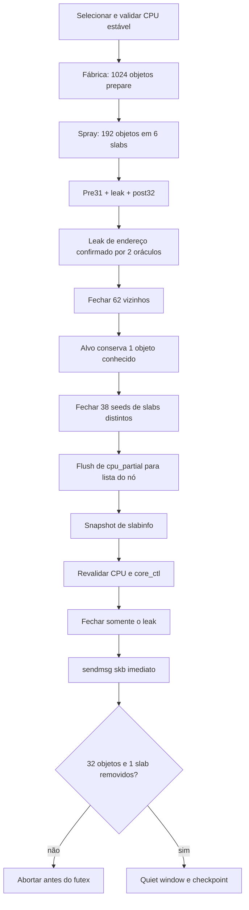

# Reclaim determinístico e descoberta inteligente de CPU

> **Escopo histórico:** este documento veio do engine AFZH3 usado como base.
> A execução e os endereços ZZHL estão no relatório 17.

Este documento consolida a investigação e a correção do reclaim do slab
`mm_struct` usado para instalar o objeto fake FOPS no alvo AFZH3. Ele registra
o sintoma, as provas obtidas no device e no kernel source, as alternativas que
falharam, a solução final, os critérios fail-closed, a validação isolada e os
artefatos Android produzidos.

## 1. Escopo e estado

Alvo:

```text
Device     Samsung Galaxy S23 Ultra SM-S918B
Codinome   dm3q_eur_openx
Firmware   S918BXXSAFZH3
Kernel     5.15.189-android13-8-33413713-abS918BXXSAFZH3
Serial     RXCX602E20X
```

A correção foi validada por um harness isolado que executa a mesma criação,
leak, liberação e entrega por skb do payload, mas usa endereços fake e não
executa o trigger futex nem escreve no kernel. Foram seis execuções
consecutivas bem-sucedidas. O APK foi compilado, instalado e lido de volta com
hash idêntico. O fluxo root completo deste artefato ainda precisa de uma
campanha em boots limpos.

## 2. Falha observada

A assinatura original era:

```text
[groom] exact reclaim active_drop=14/79 object_drop=0/32
        active_slab_drop=0/1 slab_drop=0/1 pass=0
[groom] exact reclaim proof rejected expected_active_drop=79
[groom] failed before reaching the reclaim step
```

O runner recebia `SIGTERM` da interface depois dessa rejeição controlada e
registrava código 15. Esse código não indicava kernel panic. A tentativa tinha
parado antes do futex e antes de qualquer mutação global porque a prova do
reclaim não passou.

Havia duas causas independentes:

1. a CPU inicialmente escolhida podia ser pausada pelo Samsung `core_ctl`,
   causando migração entre criação, liberação e reclaim;
2. mesmo na mesma CPU, a página alvo podia permanecer vazia e congelada em
   `cpu_partial`, fora do buddy allocator e indisponível para o skb.

## 3. Topologia real do device

O cpuset do aplicativo permitia CPUs 0-6. A topologia observada foi:

| CPUs | `cpu_capacity` | frequência máxima | comportamento observado |
|---|---:|---:|---|
| 0-2 | 266 | 2.016 GHz | estáveis, menor capacidade |
| 3-4 | 811 | 2.803 GHz | estáveis e `preferred` |
| 5-6 | 811 | 2.803 GHz | frequentemente pausadas ou `not_preferred` |
| 7 | 1024 | 3.36 GHz | fora do cpuset do app e frequentemente pausada |

Escolher apenas a maior capacidade/frequência podia selecionar CPU5 ou CPU6.
Em uma amostra anterior, 3 de 6 tentativas apresentaram drift nessas CPUs. A
política final selecionou CPU3 no cpuset 0-6:

```text
cpu=3 capacity=811 max_freq_khz=2803200
core_ctl_known=1 paused=0 not_preferred=0
```

## 4. Prova no SLUB

Os parâmetros reais do cache `mm_struct` eram:

```text
object_size    1024 bytes
objs_per_slab  32
order          3
cpu_partial    6
min_partial    5
```

Um slab order-3 ocupa `0x8000` bytes e contém exatamente 32 objetos de
`0x400` bytes.

### 4.1 `put_cpu_partial()`

No kernel correspondente, `mm/slub.c:2728`, uma página recém-congelada é
inserida na lista parcial per-CPU. A lista anterior só é drenada quando:

```c
drain && oldpage->pobjects > slub_cpu_partial(s)
```

O campo `pobjects` é calculado quando a página entra na lista. Liberações
posteriores de outros objetos daquela página não necessariamente atualizam o
valor agregado armazenado no cabeçalho da lista. Assim, a página alvo podia
estar totalmente vazia enquanto o limite ainda parecia não ter sido atingido.

### 4.2 `__unfreeze_partials()`

Em `mm/slub.c:2632`, o kernel descongela a cadeia per-CPU. Uma página vazia é
descartada somente quando `n->nr_partial >= s->min_partial`; caso contrário,
ela entra na lista parcial do nó. A solução precisa, portanto:

- forçar o alvo a sair de `cpu_partial`;
- conservar pelo menos um objeto alvo vivo durante esse flush;
- manter parciais suficientes no nó;
- liberar por último uma referência que seja comprovadamente do alvo.

### 4.3 Por que `active_objs` enganava

`get_slabinfo()` em `mm/slub.c:6438` calcula `nr_free` com
`count_partial(n, count_free)`, que percorre a lista parcial do nó. Objetos
livres ainda presos nas listas per-CPU não entram nessa conta.

Por isso `active_drop == quantidade_de_FDs_fechados` não é uma prova válida.
Os contadores estruturais são confiáveis para este gate:

```text
num_objs      -32
active_slabs   -1
num_slabs      -1
```

`active_drop` continua no log para diagnóstico, sem decidir o sucesso.

## 5. Evidência de trace

Kprobes temporários foram usados para acompanhar o cache `mm_struct`. Os
traces relevantes da sessão ficaram em:

```text
/tmp/afzh3-slub-confirmed-trace.txt
/tmp/afzh3-mmcache-cpu3-fail.txt
/tmp/afzh3-mmcache-refill-fail.txt
```

As observações foram:

- a liberação em lote continha todos os 32 objetos da página alvo;
- a primeira liberação colocava a página em `cpu_partial`;
- as outras 31 liberações esvaziavam a página sem corrigir o `pobjects`
  agregado que controlava o drain;
- não aparecia unfreeze/discard da página alvo na janela crítica;
- ela só era descartada durante o cleanup posterior;
- em outro run, a página correta foi descartada, mas o antigo gate rejeitou o
  resultado porque `active_drop` foi 52 em vez de 79.

Ao fim da investigação, `tracing_on=0` e `kprobe_events` estava vazio.

## 6. Alternativas testadas e descartadas

### 6.1 Comparar `active_drop` com 79

Falha porque `/proc/slabinfo` não inclui os objetos livres em `cpu_partial`.
Era possível descartar exatamente o slab alvo e ainda rejeitar a tentativa.

### 6.2 Aumentar drains no fim do lote

Foram testadas divisões como 8 liberações antecipadas e 24 tardias, mais seis
slabs do spray. A página alvo continuou congelada porque já estava vazia e
profunda na cadeia per-CPU.

### 6.3 Refill depois de esvaziar o alvo

Protótipos com 64 e 65 novos objetos por exec factory, além de variações na
ordem dos seeds, não voltaram a alocar a página alvo. O trace mostrou que ela
permanecia congelada; alocar mais `mm_struct` não selecionava deterministicamente
essa página. Esses protótipos foram removidos do source final.

### 6.4 Fixar apenas os filhos

É tarde demais: `copy_mm()` aloca o `mm_struct` antes de o filho executar seu
código de pin. O processo pai, a fábrica exec, as liberações e o reclaim
precisam permanecer na mesma CPU.

### 6.5 Escolher apenas a CPU numericamente mais alta

No AFZH3 isso selecionava CPUs sujeitas ao `core_ctl`. O tie-break final usa o
menor número entre CPUs equivalentes e estáveis, resultando em CPU3.

## 7. Solução final

A solução usa a referência vazada como âncora conhecida e a libera somente no
fim.



### 7.1 Cage de 62 referências

O arranjo crítico contém:

```text
pre31 + leak1 + post32 = 64 referências
```

O cage fecha os 31 `pre`, mais 31 `post`. Permanecem vivos:

- o `memfd_leak`, que identifica o último objeto da página alvo;
- um `post` survivor, que impede a segunda página crítica de ser descartada e
  contaminar os deltas esperados.

Depois do cage, a página alvo pode entrar em `cpu_partial`, mas ainda possui o
objeto leak e não pode ser descartada prematuramente.

### 7.2 Flush com 38 slabs distintos

O código fecha um objeto de cada slab auxiliar:

```text
32 slabs da fábrica prepare
 6 slabs do spray
38 seeds no total
```

Cada primeira liberação introduz uma página diferente na lista per-CPU. Isso
ultrapassa amplamente `cpu_partial=6`, força `__unfreeze_partials()` e move a
página alvo ainda ocupada para a lista parcial do nó.

### 7.3 Referência conhecida por último

O `memfd_leak` é duplicado sozinho para a faixa crítica iniciada no FD 8192. Um
snapshot de `slabinfo` é obtido, a CPU é revalidada e um único `close_range()`
libera a referência. Como o alvo já está no parcial do nó e existem pelo menos
`min_partial=5` páginas, a transição para `inuse=0` descarta o slab de forma
síncrona. O primeiro `sendmsg()` vem imediatamente depois.

O log esperado é:

```text
[groom] mm partial seed prepare=32 spray=6 cpu=3
[groom] target cage refs=62 seed=38 final_release=1 cpu=3
[groom] mm drain triggers=38 sk_buff reclaim sends=57/64
[groom] exact reclaim active_drop=1/1 object_drop=32/32
        active_slab_drop=1/1 slab_drop=1/1 pass=1
```

## 8. Descoberta inteligente de CPU

O módulo `src/00_cpu_discovery.c` concentra a política antes embutida no
orquestrador.

### 8.1 Seleção

1. lê a máscara efetiva com `sched_getaffinity()`;
2. lê `cpu_capacity` e `cpuinfo_max_freq` de cada CPU permitida;
3. interpreta `core_ctl/global_state`;
4. se houver candidato estável, elimina CPUs `paused` ou `not_preferred`;
5. escolhe a maior capacidade;
6. usa frequência máxima como primeiro desempate;
7. usa o menor número da CPU como desempate final.

Se `cpu_capacity` não estiver disponível, frequência passa a ser a métrica
principal. Se `core_ctl` não estiver legível, a política continua com afinidade
e capacidade; o estado é marcado como desconhecido.

### 8.2 Pin e revalidação

`cpu_discovery_pin_and_validate()`:

- aplica uma máscara de uma CPU com `sched_setaffinity()`;
- confirma a CPU atual com `sched_getcpu()`;
- relê `core_ctl`;
- falha com `EXDEV` se houve drift;
- falha com `EAGAIN` se a CPU ficou pausada ou não preferida.

O grooming revalida antes da criação crítica e antes das transições de cage,
seed e liberação final. Qualquer mudança aborta a tentativa antes do futex.

## 9. Gate e comportamento em falha

A execução só avança quando todas as condições passam:

| Verificação | Condição |
|---|---|
| CPU | afinidade aplicada, CPU atual correta, `core_ctl` estável |
| Cage | 62 descritores preparados e fechados por `close_range()` |
| Seeds | 38 descritores de slabs distintos preparados e fechados |
| Final | exatamente uma referência conhecida fechada |
| Reclaim skb | pelo menos 48 envios completos; normalmente 57/64 |
| Objetos | `num_objs` cai exatamente 32 |
| Slabs | `active_slabs` e `num_slabs` caem exatamente 1 |
| Quiet window | três amostras consecutivas estáveis |

Falha de preparação de FD, drift de CPU, mudança de `core_ctl`, snapshot
inválido, envio incompleto, delta incorreto ou quiet window instável segue para
cleanup. Nenhuma dessas rejeições executa o trigger futex ou altera
`ashmem_misc.fops`.

## 10. Validação isolada

Comando usado:

```sh
GROOM_CPU=3 \
CVE43499_MM_FACTORY=/data/local/tmp/afzh3-mm-factory \
/data/local/tmp/afzh3-test-groom
```

Resultados:

| Run | Factory 1024 | Factory crítica | Tempo até fim do groom | Quiet samples | Gate |
|---:|---:|---:|---:|---:|---|
| 1 | 268 ms | 19 ms | 663 ms | 3 | PASS |
| 2 | 271 ms | 17 ms | 733 ms | 5 | PASS |
| 3 | 270 ms | 18 ms | 1.135 s | 10 | PASS |
| 4 | 275 ms | 18 ms | 779 ms | 7 | PASS |
| 5 | 275 ms | 18 ms | 1.217 s | 23 | PASS |
| 6 | 271 ms | 18 ms | 727 ms | 6 | PASS |

Resumo:

```text
Sucesso                         6/6
object_drop                     32/32 em 6/6
active_slab_drop                1/1 em 6/6
slab_drop                       1/1 em 6/6
active_drop                     1/1 em 6/6
Factory 1024 média              271,7 ms
Factory crítica média           18,0 ms
Groom total médio               875,7 ms
Groom total mediano             756 ms
Groom total mínimo/máximo       663 ms / 1.217 ms
```

A maior variação veio da quiet window posterior à prova exata. A sequência
cage/seed/final passou em todos os casos.

O teste da política de CPU foi executado com afinidade limitada às CPUs 0-6:

```sh
taskset 7f /data/local/tmp/afzh3-test-cpu
```

Resultado:

```text
cpu=3 capacity=811 max_freq_khz=2803200
core_ctl_known=1 paused=0 not_preferred=0
```

## 11. Verificações automatizadas

`tools/check-critical-reclaim.py` impede regressões na ordem e exige:

- ausência de CPU crítica hardcoded;
- mesma CPU na fábrica e no spray;
- revalidação dinâmica;
- fábrica crítica em um PID;
- ordem cage → seed → leak final → skb → gate;
- leak ausente do cage e presente sozinho no lote final;
- nenhuma chamada entre o `close_range()` final e o primeiro `sendmsg()`;
- ausência de `sched_yield()` na janela;
- gate estrutural sem `active_drop == released_refs`;
- marcadores equivalentes no ELF compilado.

Comandos de validação:

```sh
make -B all so tests test-aar-read-plan test-fops-layout
tools/check-critical-reclaim.py --artifact build/payload.so
tools/check-repo.py
git diff --check
```

Todos passaram sem warning do compilador. `shellcheck` não estava instalado e
foi o único check opcional ignorado por `check-repo.py`.

## 12. Build e instalação Android

Pipeline:

```sh
tools/build-install-app.sh --install --serial RXCX602E20X
```

Artefatos:

| Artefato | Bytes | SHA-256 |
|---|---:|---|
| `build/payload.so` | 153896 | `410e6e1b073fdbb78618329224b83940f4f17c39daee45eddc630dac640934a2` |
| `build/mm-exec-factory` | 1816 | `3422d63142db11de2968febed36bd47d1fb22f232e40875df8c8fb0cf5b90851` |
| `stability-launcher` | 20096 | `c792b86deb54a728f6d9dc532a32ec2a6bf79bbb4ef0e51cc2a2bfed30d91108` |
| `app-debug.apk` | 81290523 | `2f44e20205ef65b7f67e0e2552520766695012f04466fc98a7d4f766d0c67d09` |

O relatório `build/afzh3-app-bundle.json` confirmou:

- payload, factory e launcher dentro do APK iguais aos artefatos locais;
- tamanhos do manifest corretos;
- APK instalado igual ao APK local, byte a byte;
- zero falhas de verificação.

Estado final observado no device após os testes:

```text
uid=0(root) gid=0(root) context=u:r:ksu:s0
SELinux Enforcing
tracing_on=0
kprobe_events=0
```

O root já existia antes dessa validação. Esse estado confirma que os testes
isolados e a instalação não deixaram tracing ativo; não conta como execução
root end-to-end do APK novo.

## 13. Arquivos envolvidos

| Arquivo | Mudança |
|---|---|
| `src/00_cpu_discovery.c/.h` | seleção, pin e revalidação de CPU |
| `src/00_orchestrator.c` | usa o módulo antes do grooming |
| `src/05_mm_slab_grooming.c` | cage62, seeds38, leak final e gate estrutural |
| `tests/test_cpu_discovery.c` | prova isolada da política de CPU |
| `tests/test_groom.c` | permite CPU explícita com `GROOM_CPU` |
| `tools/check-critical-reclaim.py` | verificação estática de ordem e artefato |
| `Makefile` | inclui módulo e testes em todos os targets relevantes |
| `app/src/main/assets/` | payload, factory, launcher e manifest sincronizados |

## 14. Como diagnosticar regressões

### CPU rejeitada

Procurar:

```text
groom CPU selection failed
critical CPU drift
partial seed CPU drift
```

Registrar afinidade efetiva, `core_ctl/global_state`, capacidade e frequência.
Não substituir a política por uma CPU fixa sem medir o estado do scheduler.

### `object_drop=0`

Confirmar primeiro:

```text
target cage refs=62 seed=38 final_release=1
```

Depois conferir `cpu_partial`, `min_partial`, geometria do cache, CPU esperada e
CPU real. Mudança nesses parâmetros invalida a prova de que 38 seeds são
suficientes.

### `active_drop` diferente

Tratar como telemetria. A decisão continua baseada em `object_drop`,
`active_slab_drop` e `slab_drop`. Não restaurar o antigo gate de 79 ativos.

### Menos de 48 skbs

É rejeição segura. Conferir `SO_SNDBUF`, memória disponível e atividade do
device. Não reduzir o mínimo sem uma campanha específica.

## 15. Limitações e validação pendente

- A prova 6/6 cobre o grooming isolado na mesma build e no mesmo device.
- O teste não executa futex, AAR/AAW, pipe R/W, UMH ou KernelSU.
- O APK está instalado e verificado, mas este hash ainda não passou uma
  campanha root em boots limpos.
- Parâmetros diferentes de `mm_struct` exigem recalcular o número de seeds e
  revisar o gate.
- Se `core_ctl` não puder ser lido, a política aceita a melhor CPU permitida e
  registra `core_ctl_known=0`; essa condição deve aparecer na evidência de uma
  campanha final.

Aceitação final recomendada: pelo menos três boots limpos, um único root por
boot, boot ID inalterado durante cada execução, prova externa de `su -c id`,
ausência de panic e logs contendo CPU estável, `cage=62`, `seed=38`,
`final_release=1` e gate exato aprovado.
