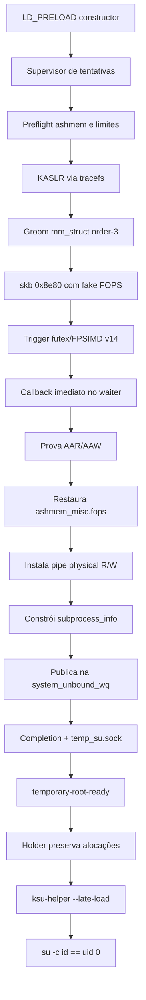

# Arquitetura e fluxo completo

## Visão geral

O shared object roda pelo constructor quando `LD_PRELOAD` carrega
`/system/bin/true`. Um supervisor cria tentativas limitadas. Dentro da tentativa
bem-sucedida, o processo prepara KASLR e allocator, dispara o trigger futex,
executa o callback de verificação no thread correto, instala o backend físico,
publica o usermode helper e preserva as alocações necessárias num holder.



## 1. Entrada e supervisor

`src/main.c` possui dois modos de build:

- executável PIE `build/app_main`, útil para diagnóstico;
- shared object `build/oss_clone_payload.so`, carregado por `LD_PRELOAD`.

No início, o processo:

- eleva os soft limits de `RLIMIT_NOFILE` e `RLIMIT_NPROC` ao hard limit;
- fixa o fluxo principal em CPU0;
- valida `CVE43499_ROOT_HELPER`;
- prepara estado compartilhado de 0x20 bytes;
- limita quantidade e duração das tentativas.

O estado compartilhado contém status terminal e campos do handoff P0. Uma
tentativa que já realizou mutação potencialmente terminal não deve ser tratada
como uma tentativa comum e repetida cegamente.

## 2. Preflight da primitiva ashmem

Antes de tocar o reclaim, `oss_prepare_kernel_rw_path()` procura um nó ashmem
que o contexto shell consiga abrir. No alvo, `/dev/ashmem` canônico é negado,
mas o alias associado ao boot pode ser aberto.

Esse preflight existe para evitar disparar a corrupção e descobrir depois que
o descritor necessário para verificar/restaurar a estrutura global não pode ser
obtido.

## 3. Localização KASLR

`src/kaslr.c` usa tracefs e `sched_blocked_reason` para derivar a base. O fluxo
preferido continua sendo tracefs mesmo quando `SLIDE_P0_OFFSET` existe; o offset
forçado é fallback validado por faixa e alinhamento de 64 KiB.

Marcas esperadas:

```text
stage=locating-kernel
[kaslr] source=tracefs base=... slide=... p0_offset=...
stage=kernel-location-ready
```

Sem base confiável, nenhum offset do alvo é seguro.

## 4. Groom e fake FOPS

`src/groom.c` prepara slabs order-3 de `mm_struct`, usa kernelsnitch para obter
uma candidata e calcula:

```text
A = candidate & ~0x7fff
D = A - 0xe80
```

O skb enviado tem `0x8e80` bytes. Seus dados começam em `D`. Logo, o conteúdo
no offset `+0x2000` do buffer do usuário cai em `A+0x1180`, onde a tabela fake
FOPS é construída. Confundir `D` com `A` desloca todos os ponteiros internos.

O reclaim depende de CPU0 porque as listas de páginas são per-CPU.
`kernelsnitch_bruteforce()` pode limpar afinidade; por isso o código fixa CPU0
novamente imediatamente após o envio de priming e antes das liberações.

## 5. Trigger futex/FPSIMD

`src/futex_trigger.c` implementa waiter, owner e consumer. A variante padrão
v14 preserva o handshake relevante:

```text
-1 -> gate -> SIGUSR1 -> 1 -> sched_setattr
```

O callback que verifica a corrupção roda no waiter, imediatamente após o
`sched_setattr` bem-sucedido. Mover essa verificação para o thread principal,
após joins ou logs, altera a janela observada pelo kernel.

Enquanto o waiter executa o callback e aguarda a preparação física, o loop
principal v14 chama `oss_pipe_rw_service_pending()` a cada 10 ms. Isso permite
que o grooming do segundo backend aconteça no contexto/lifetime correto sem
bloquear indefinidamente o callback.

## 6. Callback imediato e restauração global

`do_one_attempt_post_trigger()`:

1. abre o nó ashmem já resolvido;
2. lê `ashmem_misc.fops` e comprova o landing;
3. conserva o descritor aberto com seu `f_op` já capturado;
4. restaura o ponteiro global para a tabela estática real;
5. instala o backend pipe;
6. chama `root_umh_install_fd()` usando o mesmo descritor;
7. limpa o campo owner da fake FOPS;
8. emite `stage=temporary-root-ready` somente se tudo passou.

A restauração precoce remove o dangling pointer global. O descritor aberto
continua útil porque o VFS já associou seu `f_op` na abertura.

## 7. Segundo reclaim: backend físico por pipes

O backend em `src/pipe_physrw.c` cria dois bancos de 240 pipes. Após a segunda
geometria de `mm_struct`, um slab order-3 é reclamado por objetos de pipe. O
código identifica um `pipe_buffer`, confirma o victim por alteração controlada
do comprimento e prova leitura e escrita numa região scratch de `payload_base`.

Esse backend é necessário porque os objetos `pool_workqueue` e estruturas
associadas estão em SLUB dinâmico. Ler esses objetos pelo caminho configfs
acionava HARDENED_USERCOPY.

## 8. Publicação do usermode helper

`src/root_umh.c` usa configfs somente para:

- alterar `selinux_enforcing` conforme o fluxo fechado;
- ler o slot estático `system_unbound_wq`.

Todos os campos dinâmicos de `workqueue_struct`, `pool_workqueue`, pool,
contadores, lista, blobs e completion usam pipe R/W.

O código valida ponteiros direct-map, relação `pwq->wq`, lista vazia, worker
idle, cor, refcount e limites active/max. Depois escreve os blobs, revalida o
pool, atualiza contadores, publica a lista e força atividade na workqueue pela
abertura/fechamento de PTY.

## 9. Completion, socket e holder

Root temporário só é aceito quando:

- o campo completion fica não zero;
- o socket `/data/local/tmp/temp_su.sock` aceita conexão.

Após sucesso, `spawn_allocation_keeper()` cria `cve43499-hold`, desacopla o
processo e conserva descritores/alocações herdados. O helper e o payload
principal podem encerrar sem liberar imediatamente memória ainda referenciada.

## 10. Late-load KernelSU

O runner envia helper, payload e ksud. Após `temporary-root-ready`, executa:

```text
ksu-helper --late-load
```

O controle KernelSU é validado antes da prova final. Como `/system/bin/su` pode
aparecer alguns segundos depois, o runner consulta `su -c id` por até 30 s. O
único sucesso final é uma saída contendo `uid=0(root)`.

## Lifetimes importantes

| Recurso | Deve sobreviver até |
|---|---|
| memfds do primeiro groom | Landing, callback e restauração segura. |
| fd ashmem aberto | Fim de `root_umh` e limpeza do owner. |
| reclaim sockets fake FOPS | Holder assumir lifetime. |
| bancos de reclaim pipe | Fim dos acessos dinâmicos/completion. |
| holder do pipe backend | Enquanto a primitiva física estiver em uso. |
| blob fake work/UMH | Workqueue consumir e completar. |
| `cve43499-hold` | Estabilidade do root temporário/late-load. |

Fechar um recurso “não usado pelo userspace” pode liberar exatamente o objeto
que o kernel ainda está prestes a dereferenciar.
