# BOPE ZZI8 complete execution flow · latest One UI 9 Beta 2 firmware

This document maps the current `S918BXXUAZZI8` path for the latest One UI 9
Beta 2 firmware, from the Android app's launch request to temporary root,
KernelSU Next late-load, and final root verification. It follows the production
code, including the pre-mutation retry boundary and the paths that deliberately
require a reboot after kernel state has changed.

The diagram is intentionally large. Read it from top to bottom; each colored
block is one execution layer, and the dashed arrows show failure handling or
target-specific data feeding a stage.

```mermaid
flowchart TD
    USER([User taps Root])
    TARGET["target.h firmware contract<br/>identity, symbols, BTF layouts,<br/>object geometry and calibrated limits"]

    subgraph APP["1 · Android app and Stability Launcher"]
        A1["Match exact model, build, fingerprint,<br/>kernel release and kernel version"]
        A2{"Latest One UI 9 Beta 2<br/>ZZI8 profile matches?"}
        A3["Extract and stage verified artifacts<br/>payload.so, root helper, mm factory,<br/>Stability Launcher and target ksud"]
        A4["Launcher rejects inherited LD_PRELOAD<br/>and validates every ELF"]
        A5["Optional app-side process quiesce<br/>before starting the launcher"]
        A6["Gate requires boot complete,<br/>SELinux enforcing and at least 60 seconds uptime"]
        A7["Sample available memory, temperature,<br/>runnable tasks, CPU/memory/I/O PSI<br/>and mm_struct slab churn"]
        A8["Probe capacity for 480 pipes<br/>grown from 2 to 32 pages"]
        A9{"Three baseline samples or<br/>two comfortable samples?"}
        A10["Fast lane: 2 clean samples<br/>at 1 second cadence"]
        A11["Normal lane: 3 clean samples<br/>at 2 second cadence; noise resets streak"]
        A12["Pipe probe failed or no stability<br/>within 300 seconds: do not load payload"]
        A13["Set helper and factory paths<br/>3 exploit attempts, bounded timeouts,<br/>BOOT_QUIET_SEC=0 and FUTEX_WAIT_SEC=1"]
        A14["Set LD_PRELOAD and immediately<br/>execve /system/bin/true"]
    end

    subgraph ENTRY["2 · BOPE entry and attempt supervisor"]
        B1["payload.so constructor enters app_main<br/>start BOPE-only monotonic timer"]
        B2["Print BOPE initialization banner<br/>and disable stdio buffering"]
        B3{"Exact runtime target still matches?"}
        B4["Optional allocator quiet window<br/>normally skipped because launcher set 0"]
        B5["Create shared attempt state<br/>status, dirty flag and cached KASLR data"]
        B6["Supervisor forks isolated attempt child<br/>with attempt-specific timing offset"]
        B7["Parent polls child and shared state<br/>P0 timeout before KASLR, full timeout after"]
    end

    subgraph PREFLIGHT["3 · Child preflight and live kernel base"]
        C1["Raise RLIMIT_NOFILE and RLIMIT_NPROC"]
        C2["Validate executable root helper<br/>and freestanding mm exec factory"]
        C3["Resolve an openable ashmem node<br/>boot-id alias, matching device alias,<br/>then canonical /dev/ashmem"]
        C4["Select fastest allowed stable CPU<br/>respect cpuset and Samsung core_ctl;<br/>pin and verify it"]
        C5["Enable sched_blocked_reason in tracefs<br/>and generate blocking I/O activity"]
        C6["Read every per-CPU raw trace ring<br/>and derive KASLR slide from worker caller"]
        C7{"Two votes for one aligned slide?"}
        C8{"Valid cached SLIDE_P0_OFFSET?"}
        C9["Publish kernel base and cached slide<br/>set shared dirty flag"]
        C10["Read /proc/slabinfo mm_struct geometry<br/>and reject wrong size, order or high load"]
    end

    subgraph GROOM["4 · mm_struct address leak and exact slab reclaim"]
        G1["mm exec factory repeatedly execves itself<br/>each generation creates a fresh mm_struct;<br/>/proc/PID/mem FDs pin old generations"]
        G2["Create 1024 preparation objects<br/>plus 192 spray objects on selected CPU"]
        G3["Build critical sequence<br/>31 pre objects + leak target + 32 post objects"]
        G4["Start two KernelSnitch oracles<br/>with disjoint futex collision sets"]
        G5["Pile waiters into one futex hash bucket<br/>scan candidate user addresses in parallel"]
        G6{"Both collision sets confirmed?"}
        G7["Bruteforce the 64 GiB identity range<br/>using futex wake timing"]
        G8{"Both oracles resolve the same<br/>aligned mm_struct address?"}
        G9["Align leak to the 32 KiB order-3 slab<br/>and calculate the target object index"]
        G10["Build one 0x8e80 reclaim buffer<br/>fake lock, rt_mutex waiter, fake task,<br/>primary FOPS and recovery FOPS"]
        G11{"Local layout, self-pointers,<br/>callbacks and buffer hash valid?"}
        G12["Prime per-CPU allocator and release<br/>surrounding cage references first"]
        G13["Drain seeded partial slabs<br/>keep the known leak reference until last"]
        G14["Close the target reference last<br/>immediately send up to 64 sk_buff copies"]
        G15{"At least 48 full sends and exact proof:<br/>32 objects + one active slab + one slab dropped?"}
        G16{"mm_struct, skbuff_head_cache and<br/>kmalloc-4k quiet for 3 samples?"}
        G17["Keep reclaim socket FDs alive<br/>payload_base is reclaimed slab base"]
    end

    subgraph PLAN["5 · Pre-trigger ConfigFS plan validation"]
        P1["Compute read/write control blobs for<br/>ashmem_misc.fops, memstart_addr,<br/>kimage_voffset and scratch space"]
        P2["Simulate target strscpy word stores<br/>including NUL and word-tail zeroing"]
        P3{"Every control field survives exactly<br/>and address arithmetic is safe?"}
        P4["No syscall and no mutation<br/>reject this attempt safely"]
    end

    subgraph TRIGGER["6 · Futex PI v14 pointer-write trigger"]
        F1["Reset pipe state and prepare SIGUSR1<br/>FPSIMD payload for ashmem_misc.fops"]
        F2["Main thread pins CPU0<br/>waiter pins CPU3, consumer pins CPU1"]
        F3["Waiter locks pi_chain;<br/>owner locks pi_target then waits on pi_chain"]
        F4["Waiter enters FUTEX_WAIT_REQUEUE_PI<br/>main issues FUTEX_CMP_REQUEUE_PI"]
        F5["Waiter returns and publishes state=-1<br/>consumer opens the handshake gate"]
        F6{"Gate observed?"}
        F7["SIGUSR1 handler locates FPSIMD record<br/>and copies crafted PI/RB payload into it"]
        F8{"Signal frame accepted?"}
        F9["Waiter publishes state=1<br/>consumer marks MUTATION_PENDING"]
        F10["Consumer calls sched_setattr on waiter<br/>with no libc/env work in critical window"]
        F11["Kernel consumes crafted PI/RB links<br/>ashmem_misc.fops becomes primary fake FOPS"]
        F12["Shared state becomes KERNEL_MUTATED<br/>unsafe retry boundary is crossed"]
        F13{"sched_setattr route succeeded?"}
        F14["Invoke post-trigger callback immediately<br/>from the waiter thread"]
    end

    subgraph BOOTSTRAP_RW["7 · Bootstrap AAR/AAW through ashmem"]
        R1["Open the previously resolved ashmem alias"]
        R2["Fake FOPS routes read_iter/write_iter<br/>to ConfigFS handlers while preserving<br/>valid ashmem ioctl/open/release callbacks"]
        R3["ASHMEM_SET_NAME encodes control bytes;<br/>pread64/pwrite64 address kernel memory"]
        R4["Read back ashmem_misc.fops and require<br/>exact primary fake-FOPS pointer"]
        R5["Write and read a magic string<br/>inside reclaimed scratch space"]
        R6{"Pointer and magic proof pass?"}
        R7["Read memstart_addr and kimage_voffset<br/>for kernel-image to linear-map aliases"]
    end

    subgraph PIPE["8 · Upgrade to pipe-backed physical R/W"]
        W1["Default deterministic route:<br/>create 240 pipes, resize to 32 slots,<br/>write unique length/content markers"]
        W2["Walk init_task.tasks backward<br/>find current task, files, fdtable<br/>and each live pipe_inode_info"]
        W3["Resolve exact active pipe_buffer<br/>using structure, marker and length"]
        W4{"Deterministic victim found<br/>and descriptor write plan safe?"}
        W5["Legacy fallback:<br/>two 240-pipe banks + another mm leak,<br/>socket reclaim and ring-page resize"]
        W6["Find kmalloc-2k slabs through vmemmap<br/>scan structural pipe_buffer candidates"]
        W7["Temporarily forge victim pipe_buffer.page,<br/>offset and len for one-page operation"]
        W8["Prove read and write with two strings<br/>and two 64-bit tags in payload scratch"]
        W9{"Proof passes and original descriptor<br/>is restored after every operation?"}
        W10["Pipe R/W installed<br/>all later kernel access uses this path"]
        W11["Derive linear alias of ashmem_misc.fops<br/>write real ashmem_fops and read it back"]
        W12{"Original global FOPS restored?"}
        W13["Mark FOPS_RESTORED then PIPE_READY<br/>ConfigFS AAR/AAW is abandoned"]
    end

    subgraph ROOT["9 · Native PTY workqueue root bootstrap"]
        U1["Open a private PTY master/slave pair"]
        U2["Walk current task and fdtable via pipe R/W<br/>resolve file, tty_file_private and tty_struct"]
        U3["Validate tty magic, index, image ops,<br/>port pointer and idle self-linked SAK work"]
        U4["Save original tty ops table<br/>and complete SAK work tail"]
        U5["Stage subprocess_info, completion,<br/>helper path, --umh and caller UID<br/>inside reclaimed payload page"]
        U6["Clone tty ops and replace flush_buffer<br/>with CFI-compatible do_SAK"]
        U7["Convert SELinux enforcing symbol<br/>to linear alias and save original byte"]
        U8["Mark NATIVE_WORK_SUBMITTED<br/>publish fake work tail and fake ops"]
        U9["Set SELinux permissive through pipe R/W<br/>and verify readback"]
        U10["TCFLSH ioctl calls fake flush_buffer<br/>do_SAK queues the existing SAK work<br/>through the kernel native schedule_work path"]
        U11["Restore original tty ops immediately"]
        U12["call_usermodehelper_exec_work runs<br/>root helper --umh caller_UID"]
        U13["Helper verifies euid=0 and UID argument,<br/>sets real/effective UID and GID to 0,<br/>then opens temp_su.sock"]
        U14["Poll completion and root socket<br/>restore and verify original SAK work tail"]
        U15{"Root socket ready and TTY restored?"}
        U16["Clear fake FOPS owner through pipe R/W<br/>mark ROOT_READY and close ashmem FD"]
    end

    subgraph FINISH["10 · Supervisor, KernelSU Next and final verification"]
        Z1["Fork detached allocation keeper<br/>it inherits reclaim FDs and preserves<br/>the live reclaimed page"]
        Z1A{"Attempt callback returned success?"}
        Z2["Attempt child exits success<br/>supervisor stops the loop"]
        Z3["Log BOPE :: Success<br/>Root achieved in integer seconds"]
        Z4["App stages target-specific ksud<br/>and calls root helper --late-load"]
        Z5["Root daemon creates private mount namespace<br/>bind-mounts ksud over logcat and execs<br/>late-load for android13-5.15"]
        Z6["ksud selects and loads embedded<br/>KernelSU Next ZZI8 module for the<br/>latest One UI 9 Beta 2 firmware"]
        Z7["Helper obtains KernelSU control FD<br/>and verifies version, flags and ioctl"]
        Z8["Restore SELinux enforcing and verify it"]
        Z9["App stores install receipt<br/>and su -c id confirms uid=0"]
        DONE([Root active with KernelSU Next])
    end

    subgraph FAILURES["Failure and retry policy"]
        SAFE["Safe failure<br/>shared state is PRE_MUTATION"]
        CACHE{"KASLR was already published?"}
        RETRY{"Attempts remain?"}
        RETRY2["Cache slide for this boot,<br/>wait 5 seconds and fork next attempt"]
        FAIL([Stop without kernel mutation])
        UNSAFE["Post-mutation failure<br/>never kill or retry this boot"]
        HOLD["Preserve child/reclaim holders;<br/>record checkpoint and require reboot"]
        FAIL2([Stop and reboot before another attempt])
        INCOMPAT([Show unsupported firmware and stop])
    end

    USER --> A1 --> A2
    A2 -- No --> INCOMPAT
    A2 -- Yes --> A3 --> A4 --> A5 --> A6 --> A7 --> A8 --> A9
    A9 -- Comfortably stable --> A10 --> A13
    A9 -- Stable --> A11 --> A13
    A9 -- No, keep sampling --> A7
    A9 -- 300 second timeout or pipe failure --> A12 --> FAIL
    A13 --> A14 --> B1 --> B2 --> B3

    B3 -- No --> INCOMPAT
    B3 -- Yes --> B4 --> B5 --> B6
    B6 --> C1 --> C2 --> C3 --> C4 --> C5 --> C6 --> C7
    C7 -- Yes --> C9
    C7 -- No --> C8
    C8 -- Yes --> C9
    C8 -- No --> SAFE
    C9 --> C10
    C2 -. invalid .-> SAFE
    C3 -. unavailable .-> SAFE
    C4 -. no stable CPU .-> SAFE
    C10 -. wrong geometry or load .-> SAFE

    C10 --> G1 --> G2 --> G3 --> G4 --> G5 --> G6
    G6 -- No --> SAFE
    G6 -- Yes --> G7 --> G8
    G8 -- No --> SAFE
    G8 -- Yes --> G9 --> G10 --> G11
    G11 -- No --> SAFE
    G11 -- Yes --> G12 --> G13 --> G14 --> G15
    G15 -- No --> SAFE
    G15 -- Yes --> G16
    G16 -- No --> SAFE
    G16 -- Yes --> G17 --> P1 --> P2 --> P3
    P3 -- No --> P4 --> SAFE
    P3 -- Yes --> F1 --> F2 --> F3 --> F4 --> F5 --> F6

    F6 -- No --> SAFE
    F6 -- Yes --> F7 --> F8
    F8 -- No --> SAFE
    F8 -- Yes --> F9 --> F10 --> F11 --> F12 --> F13
    F13 -- No --> UNSAFE
    F13 -- Yes --> F14 --> R1 --> R2 --> R3 --> R4 --> R5 --> R6

    R1 -. open failed .-> UNSAFE
    R6 -- No --> UNSAFE
    R6 -- Yes --> R7 --> W1 --> W2 --> W3 --> W4
    W4 -- Yes --> W7
    W4 -- No --> W5 --> W6 --> W7
    W7 --> W8 --> W9
    W9 -- No, bounded retry up to 12 --> W1
    W9 -- Terminal restore failure or timeout --> UNSAFE
    W9 -- Yes --> W10 --> W11 --> W12
    W12 -- No --> UNSAFE
    W12 -- Yes --> W13 --> U1 --> U2 --> U3 --> U4 --> U5 --> U6 --> U7 --> U8 --> U9 --> U10 --> U11 --> U12 --> U13 --> U14 --> U15

    U1 -. failed before publication .-> UNSAFE
    U2 -. resolution failed .-> UNSAFE
    U3 -. validation failed .-> UNSAFE
    U7 -. alias or read failed .-> UNSAFE
    U15 -- No --> UNSAFE
    U15 -- Yes --> U16 --> Z1 --> Z1A
    Z1A -- Yes --> Z2 --> Z3 --> Z4 --> Z5 --> Z6 --> Z7 --> Z8 --> Z9 --> DONE

    SAFE --> B7 --> CACHE
    CACHE -- Yes --> RETRY2 --> RETRY
    CACHE -- No --> RETRY
    RETRY -- Yes --> B6
    RETRY -- No --> FAIL
    UNSAFE --> Z1
    Z1A -- No --> HOLD --> FAIL2

    TARGET -. identity .-> A1
    TARGET -. identity .-> B3
    TARGET -. symbols and KASLR geometry .-> C6
    TARGET -. slab and object geometry .-> G10
    TARGET -. futex ABI and timing .-> F1
    TARGET -. ConfigFS and strscpy ABI .-> P1
    TARGET -. pipe and vmemmap ABI .-> W1
    TARGET -. TTY, workqueue and SELinux ABI .-> U1

    classDef app fill:#e8f1ff,stroke:#2563eb,color:#111827;
    classDef pre fill:#eefcf3,stroke:#15803d,color:#111827;
    classDef exploit fill:#fff7df,stroke:#d97706,color:#111827;
    classDef mutation fill:#ffe4e6,stroke:#be123c,color:#111827;
    classDef success fill:#dcfce7,stroke:#16a34a,color:#111827;
    classDef fail fill:#f3f4f6,stroke:#4b5563,color:#111827;
    classDef contract fill:#f3e8ff,stroke:#7e22ce,color:#111827;

    class A1,A2,A3,A4,A5,A6,A7,A8,A9,A10,A11,A12,A13,A14 app;
    class B1,B2,B3,B4,B5,B6,B7,C1,C2,C3,C4,C5,C6,C7,C8,C9,C10 pre;
    class G1,G2,G3,G4,G5,G6,G7,G8,G9,G10,G11,G12,G13,G14,G15,G16,G17,P1,P2,P3,P4 exploit;
    class F1,F2,F3,F4,F5,F6,F7,F8,F9,F10,F11,F12,F13,F14,R1,R2,R3,R4,R5,R6,R7,W1,W2,W3,W4,W5,W6,W7,W8,W9,W10,W11,W12,W13,U1,U2,U3,U4,U5,U6,U7,U8,U9,U10,U11,U12,U13,U14,U15,U16 mutation;
    class Z1,Z1A,Z2,Z3,Z4,Z5,Z6,Z7,Z8,Z9,DONE success;
    class SAFE,CACHE,RETRY,RETRY2,FAIL,UNSAFE,HOLD,FAIL2,INCOMPAT fail;
    class TARGET contract;
```

## The important boundaries

### Before mutation: retries are allowed

The shared attempt status begins at `ATTEMPT_PRE_MUTATION`. Firmware checks,
ELF checks, KASLR discovery, the KernelSnitch leak, exact reclaim proof, and the
full ConfigFS/`strscpy()` plan validation all happen before the first global
kernel pointer is changed. A failure in this region can end the child and let
the supervisor try again. Once KASLR is known, its slide is cached for the next
attempt in the same boot.

The supervisor also uses two timeout budgets. Before the child publishes KASLR
state it may be killed at the shorter P0 timeout. After KASLR is published it
gets the full attempt timeout. This avoids spending the long budget on a child
that never passed the early discovery stage.

### The mutation boundary: futex PI v14

The v14 route coordinates waiter, owner, and consumer threads around
`FUTEX_WAIT_REQUEUE_PI` and `FUTEX_CMP_REQUEUE_PI`. The waiter uses SIGUSR1 to
place the crafted PI/RB data inside its ARM64 FPSIMD signal-frame record. Only
after the consumer sees the handshake does it mark the attempt
`ATTEMPT_MUTATION_PENDING` and call `sched_setattr`. That is the point at which
the kernel can publish the fake FOPS pointer.

From this point onward the supervisor refuses to kill the attempt or start a
new one. If the callback fails, the allocation keeper inherits the open reclaim
descriptors so the reclaimed page is not freed underneath a possibly live
kernel pointer. Another attempt requires a clean reboot.

### Two R/W primitives, with a deliberate handoff

The first primitive is temporary. After `ashmem_misc.fops` points at the fake
table, ashmem operations are redirected to ConfigFS read/write iterators.
`ASHMEM_SET_NAME` carries the control bytes, and `pread64`/`pwrite64` perform
the actual access. Before triggering, BOPE simulates the target kernel's real
word-at-a-time `strscpy()` behavior and rejects any plan whose required bytes
would be changed by NUL handling.

That bootstrap primitive is used to find and prove a pipe victim. For each
operation, BOPE temporarily rewrites one live `pipe_buffer`, accesses a direct
map page through the pipe, and restores the original descriptor. String and
64-bit round trips prove both directions. Once pipe R/W is live, the real
`ashmem_fops` pointer is restored and verified through its linear-map alias.
All later reads and writes use the pipe path; ConfigFS is no longer trusted.

### Root without editing workqueue globals

The root stage creates a private PTY and borrows its already initialized SAK
work item. BOPE preserves the original TTY state, stages a valid
`subprocess_info`, replaces only the copied TTY `flush_buffer` callback with
`do_SAK`, and uses `TCFLSH` to reach the kernel's native `schedule_work()`
path. The queued work executes the root helper through
`call_usermodehelper_exec_work`.

Success requires three independent facts: the work completion changed, the
root daemon socket accepts a connection, and the original TTY work tail was
restored byte-for-byte. The global ashmem FOPS and temporary TTY ops are also
restored before the payload reports temporary root.

### KernelSU is a separate final stage

BOPE ends when the temporary UID 0 daemon is alive and the kernel objects it
borrowed have been restored. The app then asks that daemon to execute
`--late-load`. The helper runs the target-specific `ksud`, verifies the
KernelSU control interface, restores SELinux enforcing, and only then lets the
app mark root as active.

## Review findings from the current tree

The flowchart above describes the path the code is trying to execute. A deep
read of the current ZZI8 tree for the latest One UI 9 Beta 2 firmware also
exposed a few implementation details that
are easy to miss:

1. **The latest One UI 9 Beta 2 firmware's ZZI8 launcher build is not
   self-contained.** Its Makefile currently
   reads `../../../../ksu-payload-functional/stability-launcher.c`, a sibling
   project outside this repository. That file is different from the local
   `stability-launcher/stability-launcher.c`: the external version uses three
   baseline samples, a 300-second timeout, terminal pipe-gate failure, no
   `am kill-all`, and no final two-second delay. The Mermaid follows the
   external source actually selected by the latest One UI 9 Beta 2 firmware's
   ZZI8 Makefile.
2. **The in-process KASLR retry cache loses a tracefs-derived slide.**
   `kaslr_locate_via_tracefs()` returns the absolute kernel base, but
   `do_one_attempt()` does not recalculate its local `p0_offset` afterward.
   The shared field therefore remains zero unless `SLIDE_P0_OFFSET` was
   already forced. After a safe first-attempt failure, the supervisor can set
   `SLIDE_P0_OFFSET=0` for its next child even when tracefs found a non-zero
   slide. The trace log still prints the correct offset, so the Android app can
   cache it for a later app execution, but that does not repair the current
   supervisor loop.
3. **Post-mutation recovery is preservation, not an active rewrite.** The
   function named `recover_ashmem_fops()` records a reboot-required checkpoint
   and relies on the allocation keeper to preserve the reclaimed page. The
   available `futex_v14_rewrite_pointer()` and
   `futex_v14_quarantine_pointer()` helpers have no production callers in the
   latest One UI 9 Beta 2 firmware's ZZI8 orchestrator. This makes the
   no-retry/reboot boundary essential when
   the immediate AAR/AAW verification fails.
4. **Only futex v14 is on the production path.** Older trigger generations are
   still present in `07_futex_pi_trigger.c`, but the orchestrator blocks v13
   and calls `run_futex_trigger_v14_full_staged()` in both normal and explicit
   v14 modes. The chart intentionally excludes the historical routes.
5. **The reported BOPE time is correctly separated from stabilization.** The
   monotonic timer begins inside `app_main()`, after the launcher has executed
   the preload. It includes target checks, KASLR, grooming, trigger, pipe R/W,
   and temporary-root bootstrap, then rounds up to an integer number of
   seconds. KernelSU late-load happens afterward and is not part of that time.

## Shared attempt state

| State | Meaning | Retry policy |
| --- | --- | --- |
| `ATTEMPT_PRE_MUTATION` | No global kernel pointer or native work item has been published | Safe to stop and retry |
| `ATTEMPT_MUTATION_PENDING` | Consumer is entering the critical `sched_setattr` window | Never kill or retry |
| `ATTEMPT_KERNEL_MUTATED` | The pointer-write route ran and fake FOPS may be globally visible | Preserve allocations; reboot on failure |
| `ATTEMPT_FOPS_RESTORED` | Real `ashmem_fops` was restored and read back through pipe R/W | Still no retry in this boot |
| `ATTEMPT_PIPE_READY` | Pipe-backed R/W is proven and owns later kernel access | Continue to root bootstrap |
| `ATTEMPT_NATIVE_WORK_SUBMITTED` | PTY SAK work may be queued by the kernel | Preserve PTY if restoration is uncertain |
| `ATTEMPT_ROOT_READY` | Root socket is ready and borrowed TTY state was restored | Report temporary root |

## Source map

| Stage | Production source |
| --- | --- |
| ZZI8 launcher selection for the latest One UI 9 Beta 2 firmware | [`../Makefile`](../Makefile), which currently points to the external `ksu-payload-functional/stability-launcher.c` |
| Target contract | [`../src/target.h`](../src/target.h) |
| Supervisor and complete chain | [`../src/00_orchestrator.c`](../src/00_orchestrator.c) |
| CPU selection | [`../src/00_cpu_discovery.c`](../src/00_cpu_discovery.c) |
| KASLR via tracefs | [`../src/01_kernel_base_tracefs.c`](../src/01_kernel_base_tracefs.c) |
| Slab preflight | [`../src/02_slab_cache_probe.c`](../src/02_slab_cache_probe.c) |
| KernelSnitch side channel | [`../src/03_mm_address_sidechannel/mm_address_leak.h`](../src/03_mm_address_sidechannel/mm_address_leak.h) |
| Fake object construction | [`../src/04_fake_kernel_objects.c`](../src/04_fake_kernel_objects.c) |
| Groom and exact reclaim | [`../src/05_mm_slab_grooming.c`](../src/05_mm_slab_grooming.c) |
| Signal-frame payload | [`../src/06_signal_frame_payload.c`](../src/06_signal_frame_payload.c) |
| Futex PI v14 trigger | [`../src/07_futex_pi_trigger.c`](../src/07_futex_pi_trigger.c) |
| Bootstrap AAR/AAW | [`../src/08_ashmem_configfs_rw.c`](../src/08_ashmem_configfs_rw.c) |
| Pipe physical R/W | [`../src/09_pipe_buffer_rw.c`](../src/09_pipe_buffer_rw.c) |
| PTY workqueue root | [`../src/10_workqueue_umh_root.c`](../src/10_workqueue_umh_root.c) |
| Fresh-mm exec factory | [`../factory/mm_exec_factory.c`](../factory/mm_exec_factory.c) |
